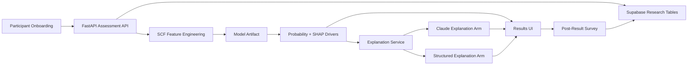

<div align="center">

```text
 ______ _       _____ _       _     _        ___   ___
|  ____(_)     / ____(_)     | |   | |      / _ \ |_ _|
| |__   _ _ __| (___  _  __ _| |__ | |_    / /_\ \ | |
|  __| | | '_ \\___ \| |/ _` | '_ \| __|   |  _  | | |
| |    | | | | |___) | | (_| | | | | |_    | | | |_| |_
|_|    |_|_| |_|_____/|_|\__, |_| |_|\__|   \_| |_/|___|
                          __/ |
                         |___/
```

# Explainable AI for Household Financial Spending Behavior

### Evaluating LLM fidelity to SHAP-based explanations for AI-assisted spending assessments

**ANA 699 Capstone Research Project**

**Dillan Johnson - John Padworski - Vincent Vitale**

Master of Science in Data Science, AI Optimization Specialty - National University - April 2026

Faculty: Dr. Mohammad Ghaznavi - Sponsor: Dr. Donald Smith - Advisor: Dr. Mohammad Yavarimanesh

[](https://python.org)
[](https://nextjs.org)
[](https://fastapi.tiangolo.com)
[](https://supabase.com)
[](https://shap.readthedocs.io)

---

*Can SHAP attributions be translated into plain language without losing fidelity, and does that explanation layer improve user understanding, trust, and confidence?*

---

</div>

## Abstract

This study develops an explainable AI pipeline for predicting household
financial overspending using the Federal Reserve's 2022 Survey of Consumer
Finances. The prediction target combines the self-reported `EXPENSHILO`
variable with a calculated spending-ratio confirmation, separating households
whose spending perception is supported by financial evidence from
perception-only overspenders. Five classifiers are evaluated with grouped
cross-validation, and SHAP attributions are used to explain individual
predictions. The application layer then translates structured SHAP outputs into
consumer-facing explanations through deterministic factor cards and an
LLM-mediated explanation condition. The deployed FinSight AI system records
assessment inputs, engineered features, model outputs, SHAP drivers, prompt
payloads, experiment assignments, and post-assessment survey responses in order
to evaluate how explanation modality affects user understanding, trust,
confidence, and behavioral intent.

---

## Overview

FinSight AI is a capstone research platform for studying explainable financial
machine learning. The project is not intended to replicate a generic personal
finance dashboard. It is a research instrument for evaluating whether technical
model explanations can be translated into user-facing explanations that remain
faithful to the underlying SHAP attributions.

The central modeling problem is household overspending prediction. The raw SCF
`EXPENSHILO` target alone proved too noisy for reliable modeling because it
mixes financially strained households with high-wealth households that reported
spending above income for reasons that do not resemble chronic strain. The final
research target therefore requires both self-reported overspending and financial
confirmation using a spending-ratio threshold.

The research interface asks participants for household and financial details,
generates a model prediction, ranks the most influential SHAP drivers, and
assigns participants to one of three explanation conditions:

| Arm | Participant Experience | Research Purpose |
|---|---|---|
| `control` | Prediction and drivers only | Baseline comprehension and trust |
| `structured_explanation` | Deterministic plain-language explanation and factor cards | Tests whether structured XAI improves interpretability |
| `llm_explanation` | Claude-generated explanation plus deterministic cards | Tests whether LLM-mediated explanation improves perceived clarity or trust |

The deployed system logs inputs, engineered features, predictions, drivers,
explanation payloads, LLM prompt payloads, experiment arm, and survey responses
for later analysis.

---

## Research Questions

Primary research question:

> How does explainability, specifically SHAP-based feature attribution and
> LLM-generated plain-language explanations, impact user understanding of, trust
> in, and confidence in AI-assisted financial spending assessments?

Sub-questions:

1. Can a machine learning classifier predict whether a household's expenses
   exceed income using financial profile features from the Federal Reserve
   Survey of Consumer Finances?
2. Can SHAP-derived feature attributions identify the factors driving individual
   overspending predictions, and do those attributions align with established
   behavioral finance research?
3. Can an LLM translate SHAP attributions into plain-language explanations that
   preserve quantitative fidelity, remain consistent with behavioral finance
   theory, and produce measurable user trust and confidence?

---

## Core Concepts

| Concept | Description |
|---|---|
| SCF | Survey of Consumer Finances, the household finance dataset used for model development |
| `EXPENSHILO` | SCF variable indicating whether spending exceeded income |
| Confirmed overspending target | Positive class combines self-reported overspending with spending above the dataset median |
| SHAP | Local attribution method used to rank feature contributions for each prediction |
| LLM fidelity | Degree to which generated explanations preserve SHAP direction, magnitude, and ranking |
| LLM explanation | Claude-generated participant-facing summary based on model facts and SHAP drivers |
| Experiment arm | Randomized condition controlling whether participants see no explanation, structured explanation, or LLM explanation |
| Survey outcome | Post-result measures of understanding, trust, clarity, actionability, and confusion |

---

## Thesis Findings

The final paper reports a five-model analysis on the SCF 2022 extract using
22,975 records representing 4,595 households across the SCF implicates.

### Target Variable Refinement

The initial raw `EXPENSHILO` target reached a performance ceiling near 58%
accuracy. Rule-based analysis found that 27% of self-reported overspenders were
wealthy households whose financial profiles were statistically similar to
non-overspenders. The confirmed overspending target resolved this by requiring
both subjective perception and measurable spending evidence.

| Population Segment | Share |
|---|---:|
| Healthy on both measures | 28.6% |
| Perception-only overspenders | 21.4% |
| High spending ratio without overspending perception | 22.0% |
| Confirmed overspenders | 28.0% |

### Model Performance

| Model | Accuracy | AUC-ROC | CV AUC | CV Accuracy | F1 |
|---|---:|---:|---:|---:|---:|
| Logistic Regression | 75.9% | 0.780 | 0.787 +/- 0.016 | 74.4% +/- 1.6% | 0.440 |
| Random Forest | 74.4% | 0.821 | **0.838 +/- 0.017** | **76.7% +/- 1.5%** | 0.637 |
| XGBoost | 74.1% | 0.819 | 0.833 +/- 0.014 | 75.8% +/- 1.5% | **0.639** |
| CatBoost | 73.3% | 0.825 | 0.833 +/- 0.017 | 75.4% +/- 2.0% | 0.628 |
| GradientBoosting | **76.1%** | **0.834** | 0.834 +/- 0.016 | 75.5% +/- 1.1% | 0.580 |

Key findings:

- Confirmed overspending improved accuracy from 57.6% to 76.1%.
- Cross-validated AUC improved from 0.612 to 0.838.
- The naive majority-class baseline was 72.0%, so the models learned signal
  beyond class frequency.
- GradientBoosting achieved the highest test accuracy and AUC.
- Random Forest achieved the highest cross-validated AUC and CV accuracy.

### SHAP Findings

The final paper identifies food spending ratio and leverage as the dominant
model explanations:

| Feature | Thesis Finding |
|---|---|
| `FOOD_TO_INC` | Dominant global SHAP driver; mean absolute SHAP = 1.208 |
| `LEVRATIO` | Second strongest driver; mean absolute SHAP = 0.775 |
| `PAYMENT_TO_INC` | Third strongest driver; mean absolute SHAP = 0.318 |
| `NWPCTLECAT` | High net worth percentile generally lowers predicted overspending |
| `HCCBAL` | Credit card balances add financial pressure |

Representative waterfall profiles in the thesis include a high-risk household
at 87.6%, a borderline case at 50.0%, and a financially stable household at
0.6%.

---

## Current Repository Artifact

The deployed API artifact in this repository is trained from:

```text
backend/data/SCFP2022.csv
```

The current exported artifact reports:

| Property | Value |
|---|---:|
| Records | 22,975 |
| Households | 4,595 |
| Positive target rate | 28.14% |
| Target | `(EXPENSHILO == 1) AND (SPEND_RATIO > dataset median)` |
| Current API prediction model | XGBoost |
| Current API SHAP model | XGBoost |
| Calibration | Group-aware prefit isotonic calibration |
| Artifact version | `expenshilo-artifact-v1` |
| Feature version | `scf-expenshilo-features-v1` |

The current API artifact uses XGBoost based on the exported backend artifact,
while the final thesis reports the broader five-model comparison above. This
distinction is intentional in the README so the research results and deployed
implementation remain traceable.

### Current API Artifact Metrics

| Model | Accuracy | Test AUC | CV AUC Mean | F1 | Brier |
|---|---:|---:|---:|---:|---:|
| Logistic Regression | 0.728 | 0.800 | 0.811 | 0.617 | 0.194 |
| Random Forest | 0.746 | 0.816 | 0.835 | 0.576 | 0.156 |
| XGBoost | 0.741 | 0.814 | **0.839** | 0.532 | 0.166 |
| Neural Network (MLP) | **0.751** | 0.800 | 0.783 | 0.553 | 0.164 |

| Calibrated Metric | Value |
|---|---:|
| AUC ROC | 0.797 |
| Accuracy | 0.734 |
| Brier score | 0.160 |

---

## LLM Explanation and Trust Evaluation

The LLM layer operationalizes the main research contribution: translating SHAP
outputs into consumer-facing explanations while preserving fidelity to the
underlying attribution signal.

The backend returns three explanation layers:

1. Prediction probability: calibrated `expenshilo_probability`
2. SHAP drivers: ranked features that increased or decreased the estimate
3. Participant-facing explanations: deterministic summaries, factor cards, and
   optional Claude-generated explanations

Claude prompts are defined in:

```text
backend/api/explanations.py
```

LLM request payloads are stored in Supabase:

```text
llm_explanations.request_payload
```

This allows prompt auditing and later comparison between generated explanations,
participant responses, and experiment arms.

The three-arm experiment isolates explanation modality:

| Arm | Explanation Modality |
|---|---|
| `control` | Prediction probability and ranked SHAP drivers only |
| `structured_explanation` | Algorithmic plain-language summary and deterministic factor cards |
| `llm_explanation` | Claude-generated narrative using probability, SHAP drivers, and user profile facts |

The survey is linked to `assessment_id` and captures comprehension, trust,
confidence, behavioral intent, and timing metadata. The thesis identifies a
future target of at least 30 participants per arm, or 90 participants total, to
detect medium effect sizes.

---

## Research Data Captured

| Table | Research Record |
|---|---|
| `assessments` | Raw input, research consent, engineered features, prediction, SHAP drivers, explanation payload, experiment arm |
| `llm_explanations` | Prompt version, Claude model name, request payload, response text, status metadata |
| `survey_responses` | Assessment link, survey version, experiment arm, answers JSON, timing/context metadata |

This makes the app a controlled data-collection instrument rather than a
frontend demonstration.

---

## System Architecture



---

## Project Structure

```text
ana_600_capstone/
|
|-- backend/
|   |-- api/                         # FastAPI service, auth, store, explanations
|   |-- inference/                   # Artifact loading, feature engineering, prediction
|   |-- artifacts/                   # Exported model artifact
|   |-- data/                        # SCF/SHED research data files
|   |-- outputs/                     # Model comparison and SHAP outputs
|   |-- supabase/                    # Research database schema
|   |-- tests/                       # Backend API and explanation tests
|   |-- scf_spending_pipeline.py     # Research training and SHAP analysis pipeline
|   |-- train_expenshilo_artifact.py # Artifact export command
|   `-- run_api.py                   # Local API runner
|
|-- src/
|   |-- app/
|   |   |-- (onboarding)/            # Participant onboarding flow
|   |   |-- assessment-results/      # Result, explanation, and survey page
|   |   |-- (protected)/backend-lab/ # Internal backend test page
|   |   `-- page.tsx                 # Landing page
|   |-- lib/api/                     # Frontend API client
|   |-- lib/onboarding/              # Onboarding session helpers
|   |-- lib/supabase/                # Supabase client/server helpers
|   `-- components/                  # UI components
|
|-- docs/                            # API, CLI, persistence, and explanation docs
|-- package.json
|-- README.md
`-- .env.example
```

---

## Installation

### Prerequisites

- Node.js 18+
- npm
- Python 3.12 recommended
- Supabase project
- Anthropic API key if testing Claude explanations

### Frontend

```bash
git clone <repository-url>
cd <repo-directory>
npm install
npm run dev
```

Open:

```text
http://localhost:3000
```

### Backend

```bash
python -m venv .venv

# Windows
.\.venv\Scripts\Activate.ps1

# macOS/Linux
source .venv/bin/activate

python -m pip install -r backend/requirements.txt
python backend/train_expenshilo_artifact.py
python backend/run_api.py
```

Open the local API docs:

```text
http://127.0.0.1:8000/docs
```

---

## Environment Configuration

Copy `.env.example` into the env files used by your environment.

Frontend local env:

```env
NEXT_PUBLIC_SUPABASE_URL=your-supabase-url
NEXT_PUBLIC_SUPABASE_ANON_KEY=your-supabase-anon-key
NEXT_PUBLIC_ASSESSMENT_API_URL=http://127.0.0.1:8000
```

Backend local or deployed env:

```env
EXPENSHILO_ARTIFACT_PATH=backend/artifacts/expenshilo_artifact.pkl
FINSIGHT_STORE_BACKEND=supabase
FINSIGHT_AUTH_MODE=supabase
SUPABASE_URL=your-supabase-url
SUPABASE_ANON_KEY=your-supabase-anon-key
SUPABASE_SERVICE_ROLE_KEY=your-service-role-key
ANTHROPIC_API_KEY=your-anthropic-api-key
ANTHROPIC_MODEL=claude-opus-4-7
```

Important: Supabase service-role keys belong only on the backend.

---

## API Endpoints

| Method | Endpoint | Purpose |
|---|---|---|
| `GET` | `/health` | Runtime, artifact, auth, store, and LLM status |
| `GET` | `/v1/reference/onboarding-schema` | Field contract for onboarding |
| `POST` | `/v1/assessments` | Create assessment, prediction, SHAP drivers, experiment arm, explanation |
| `GET` | `/v1/assessments/{assessment_id}` | Fetch saved assessment |
| `POST` | `/v1/assessments/{assessment_id}/simulations` | Result-screen calculator re-score |
| `POST` | `/v1/assessments/{assessment_id}/survey-responses` | Save post-result survey response |

---

## Testing

Backend:

```bash
python -m unittest backend.tests.test_inference_features backend.tests.test_api_app backend.tests.test_explanations -v
```

Frontend type check:

```bash
npx tsc --noEmit
```

---

## Documentation

- [CLI Commands](docs/cli-commands.md)
- [Frontend API Handoff](docs/frontend-api-handoff.md)
- [Phase 4 Persistence and Experiments](docs/phase-04-persistence-and-experiments.md)
- [Phase 5 Claude Explanations](docs/phase-05-llm-explanations.md)

---

## Limitations

- SCF data is cross-sectional and does not capture real-time household
  transaction trajectories.
- `EXPENSHILO` is self-reported and may reflect perception, recall error, or
  temporary one-time spending events.
- The user trust survey uses a convenience sample in an academic capstone
  context, so results should be interpreted as preliminary evidence.
- Explanation quality must be evaluated through fidelity checks and participant
  survey responses, not assumed from LLM fluency.
- What-if scenarios are model sensitivity checks holding other inputs constant;
  they are not financial advice.
- The deployed app is a research system and should not be treated as a
  production personal finance recommendation engine.

---

## References

- Board of Governors of the Federal Reserve System. Survey of Consumer Finances. https://www.federalreserve.gov/econres/scfindex.htm
- Lundberg, S. M. and Lee, S. I. (2017). A Unified Approach to Interpreting Model Predictions. https://arxiv.org/abs/1705.07874
- Chen, T. and Guestrin, C. (2016). XGBoost: A Scalable Tree Boosting System. https://arxiv.org/abs/1603.02754
- Ribeiro, M. T., Singh, S., and Guestrin, C. (2016). "Why Should I Trust You?": Explaining the Predictions of Any Classifier. https://arxiv.org/abs/1602.04938
- Hoffman, R. R. et al. (2018). Metrics for Explainable AI: Challenges and Prospects. https://arxiv.org/abs/1812.04608
- Holzinger, A. et al. (2020). The System Causability Scale. https://link.springer.com/article/10.1007/s13218-020-00636-z
- Jian, J. Y., Bisantz, A. M., and Drury, C. G. (2000). Foundations for an Empirically Determined Scale of Trust in Automated Systems. https://doi.org/10.1016/S1071-5819(99)00039-9
- Xiao, J. J. and Porto, N. (2019). Present bias and financial behavior.

---

## Citation

```bibtex
@mastersthesis{johnson_padworski_vitale_2026,
  title   = {Explainable AI for Household Financial Spending Behavior:
             Evaluating LLM Fidelity to SHAP-Based Explanations},
  author  = {Johnson, Dillan and Padworski, John and Vitale, Vincent},
  school  = {National University},
  year    = {2026},
  program = {Master of Science in Data Science, AI Optimization Specialty},
  course  = {ANA 699 Capstone Research Project}
}
```

---

## License and Use

This repository supports an academic capstone research project. Model outputs
and explanations are for research and educational use only and are not financial
advice.
